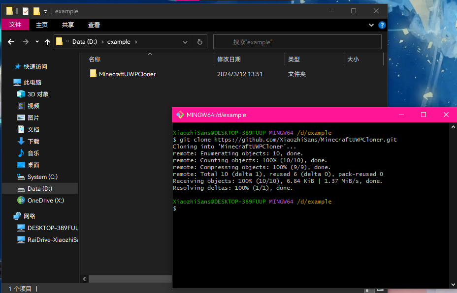
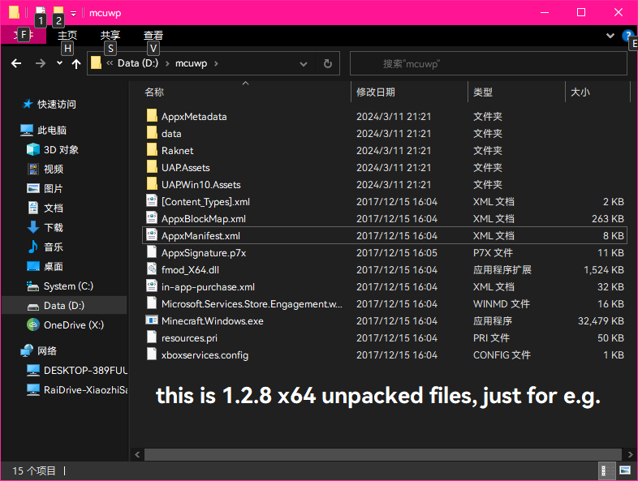
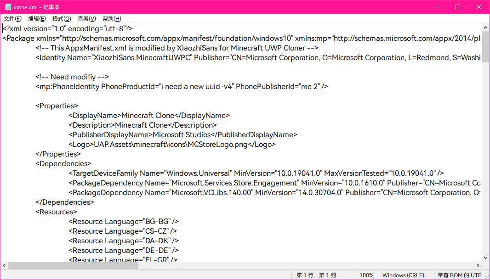
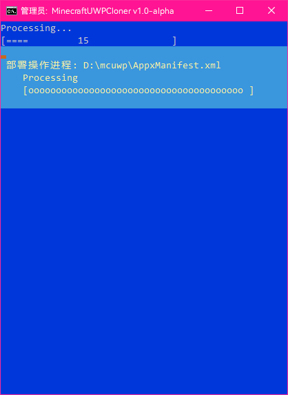
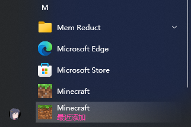

# MinecraftUWPCloner
**MineraftUWPCloner** *("MCUWPC")* is a  
Minecraft UWP (*Windows 10/11* bedrock edition)  
Cloner.  
  
---
  
## How 2 clone Minecraft UWP
1. `git clone https://github.com/XiaozhiSans/MinecraftUWPCloner.git`  
   or download release pack from [here](https://www.github.com/XiaozhiSans/releases)  
     
     

2. then open `MinecraftUWPCloner.bat`  
     
  
2.5 press **yes**  
      

3. and u will see this window  
     
   1. then input ur Minecraft appx **(afther extract)** path  
      for e.g. `d:\mcuwp`  
      ***notice: do not add "\\" at the end of path***  
        
   2. then we can see *menu*  
        
      > my advice is `2813`  
  
4. input `2` to enable UWP Dev mode  
   if u enabled, just skip  

5. input `8` to modify *clone.xml*  
     
   - in common, *maybe* we need modify *5 locations*  
      - Version  
        for e.g. `1.2.800.0`  
        ***notice: this version is not at all equal mc verion,  
        pls read oringinal AppxManifest.xml to get it***  
          
  
      - ProcessorArchitecture  
        for e.g. `x64`  
        available value: 
          - `x64`  
          - `x86`  
          - `arm`  
          - `arm64`  
  
      - PhoneProductId  
        just an *uuid-v4*, get new uuid-v4 at [here](https://uuid.online)  
  
      - PhonePublisherId  
        *ditto*  
  
      - ProjectGUID  
        just a *guid*, get new guid at [here](https://guidgenerator.com)   
  
      press `ctrl+s` to save change  
  
6. now back to step3 mentioned window  
   then input `1` and the file was soon replaced  
     
  
7. then input `3` to install **Minecraft Clone**  
     
  
8. when jump back to the menu open ur *start menu*  
     
  
9. dont forget fo and star!! ~(￣▽￣)~🌹  
  
10. enjoy!  
